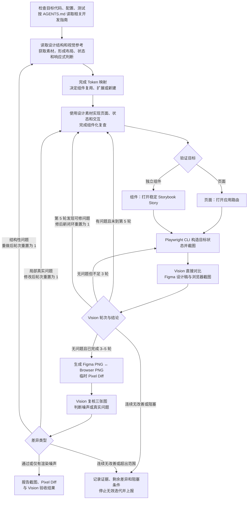

# Planet Figma 设计还原

## 目标与边界

将 Figma 设计高质量还原为当前代码库中的生产级前端实现。

重点保证：

- 高保真还原设计。
- 优先复用现有组件和 Design System。
- 正确使用 Design Token。
- 使用真实 Figma 素材。
- 保持代码可维护、可扩展。
- 通过真实浏览器截图先完成 3–5 轮 Vision 自我迭代，再用临时 Pixel Diff 和 Vision 三图复核做末端审计。

只负责 UI 实现和视觉还原，不负责：

- API Contract 设计或 API 接入。
- 业务逻辑、权限模型和缓存策略。
- 大规模架构重构。
- 与设计还原无关的功能开发。

## 输入要求

尽可能获取：

- 带 `node-id` 的 Figma Design URL。
- 目标页面、路由或组件。
- 需要实现的设计状态。
- 目标 Viewport。
- 当前代码库。

如果 Figma URL 缺少 `node-id`，要求用户提供节点级链接，不得猜测节点。

## 工作原则

按照以下主线工作；先遵守仓库约定完成定向检查，再读取设计，不得颠倒项目规定的阅读顺序：



避免：

```text
只看截图
→ 猜测 CSS
→ 堆积像素补丁
```

## 1. 先完成仓库定向

调用 Figma 工具前，先按 `AGENTS.md` 检查与目标直接相关的代码、配置和测试，再从 `docs/development/README.md` 选择任务所需的最少指南。不要预先遍历整个仓库或读取无关文档。

至少确认：

- 目标是应用页面、路由级 View，还是独立组件。
- 相关 route、view、component、Story、测试和公开出口当前如何组织。
- `src/shared/ui` 的相关组件及公开 API、`src/shared/styles/tokens.css` 的现有 Design Token。
- 现有布局、图标、素材、样式、响应式和测试约定。
- 可用于浏览器验证的稳定宿主：页面使用应用路由；独立组件优先使用现有 Storybook Story。

如果独立组件没有 Story，只有当组件具备可独立维护的稳定契约，且 Story 能长期记录有意义的 Variant、交互或边界内容时才新增或调整；否则报告缺少稳定验证宿主，不得为了截图向生产应用增加临时路由、临时 Story 或测试壳层。

形成简短的仓库侧结论，记录目标落点、可复用能力、验证宿主和必须遵守的项目约定。此阶段只做定向，不在读取 Figma 设计前决定最终视觉实现。

## 2. 理解设计稿并完成映射

写代码前，先加载 `figma-design-to-code`，再调用 `get_design_context`。

不要逐层机械翻译 Figma，也不要看到一个视觉块就立即创建组件。先理解设计意图和页面结构：

- **信息层级**：识别页面主任务、阅读顺序、主要内容、辅助信息和主要操作。
- **区域关系**：识别导航、内容、操作、反馈、弹层等区域，以及它们的包含、并列和覆盖关系。
- **重复模式**：识别列表项、卡片、表单项、操作组等重复结构，判断真正的组件边界。
- **布局规则**：先推理应使用 Document Flow、Flexbox、CSS Grid、固定定位还是其他布局策略；区分固定与流式尺寸、滚动区域、吸顶区域、弹性空间和响应式约束。将 Figma Frame 宽度视为视觉验证 Viewport，不得直接推导为生产页面宽度上限。
- **状态与交互**：理解默认、选中、禁用、加载、空、错误、展开和弹层等状态之间的关系，以及触发、切换、导航和反馈流程。
- **语义角色**：判断元素是按钮、链接、输入、标签、列表项、卡片还是纯装饰，不以外观代替语义。

再从结构数据、素材、视觉参考和 Design Token 四个方面读取设计：

- **结构数据**：检查页面层级、Auto Layout、Constraints、宽高、Padding、Gap、对齐、Typography、颜色、边框、圆角、阴影、Component、Variant 和 Variable。
- **素材**：识别并获取真实 SVG、图标、图片、Logo、插画和字体信息或文件；不要要求用户提前手动导出。
- **视觉**：获取 Figma Screenshot 作为最终参考，但不得只根据截图猜测页面结构和尺寸。
- **Design Token**：提取颜色、字体、字号、行高、间距、圆角、边框和阴影的设计值与语义，再结合仓库证据完成项目 Token 映射。

形成简短的设计侧结论，至少明确页面骨架、重复模式、组件及 Variant、状态与交互流程、响应式行为、布局策略、素材来源和待映射的 Token。结构无法解释时继续检查设计上下文，不要用 CSS 补丁掩盖理解缺失。

结合第 1 节的仓库证据，将设计值和语义映射到项目现有 Token、组件和布局模式。只有现有 Token 无法表达且需求确实时才考虑扩展。Token 映射和第 3 节的组件决策完成后再生成代码。

## 3. 决定组件方案

先判断语义、交互和归属，再判断视觉。稳定的通用语义、交互契约和实际复用证据共同决定是否进入 `shared/ui`；外观相似、Figma Component 身份或出现次数都不能单独决定归属。

只对复用、扩展、新建或归属存在实际选择的候选项记录简短决策；显然可直接复用的组件无需为表格而表格。

| 设计区域 | 语义与交互 | 代码库证据               | 决策与归属                      | 理由 |
| -------- | ---------- | ------------------------ | ------------------------------- | ---- |
| ...      | ...        | 已有 / 内联重复 / 不存在 | 复用 / 扩展 / 新建 / 保留；归属 | ...  |

按照以下边界决定归属：

- **已有组件**：语义、职责和交互契约一致时直接复用；只有受支持的视觉或组合差异时，通过 Token、Size、Variant、Slot 或 Composition 做向后兼容的扩展。
- **共享基础控件**：当前需求真实，职责不含业务概念，API 及焦点、禁用、加载、键盘和无障碍契约足够稳定时，可以在首次真实使用时进入 `shared/ui`；首次使用或第二次出现本身都不是抽取理由。
- **共享组合组件**：只有在语义和交互契约稳定，且有跨页面复用、可直接消除的重复实现或其他代码库证据时，才进入或扩展 `shared/ui`。Figma Component、Instance 和 Variant 只是辅助证据。
- **Feature 组件**：包含业务字段、领域术语、权限、流程或数据解释规则，或者通用 API 仍不稳定时，保留在所属 Feature。

对候选项依次检查：

1. 它解决什么用户问题，承担什么语义角色？
2. 它有哪些交互、状态和可访问性要求？
3. 现有组件的语义、职责和交互契约是否匹配？
4. 差异能否通过现有 API 或通用扩展自然表达，而不引入页面、业务专属 Props？
5. 共享归属的语义、契约和 API 是否已有足够证据且稳定？

修改公共组件前：

1. 阅读当前实现并搜索主要调用点。
2. 保留已有语义、状态、交互和可访问性契约。
3. 优先最小、向后兼容的通用扩展，不得加入单页面或业务特例。

不要因为 Figma 实例名称不同就重复创建组件，也不要因为现有组件“看起来接近”就强行复用。

如果需要 Breaking API Change、大范围修改 Design System、重构共享组件架构或大范围修改全局 Token，停止扩大任务并报告需要决策的问题。

## 4. 实现页面或组件

按以下顺序实现：

1. **结构**：完成目标层级、组件层级、布局模型和组件复用。
2. **几何**：调整宽高、Padding、Gap、对齐和定位。
3. **视觉**：调整 Typography、颜色、边框、圆角和阴影。
4. **素材**：处理图标、图片、Logo 和插画。
5. **细节**：修复 Overflow、文案换行、响应式问题和其他可见偏差。

普通布局优先使用 Document Flow、Flexbox、CSS Grid 和项目已有布局组件。

避免大量 Absolute Position、Magic Number、Inline Style 和截图专用补丁。允许使用设计中真实存在的特殊值，但不要为了消除渲染噪声破坏合理布局。

### 响应式宽度

- Figma Frame 的宽度是视觉验证 Viewport，不是生产页面的 `max-width`。例如 393px Frame 只表示应在 393px Viewport 检查几何和还原度。
- 页面根容器默认使用 `width: 100%` 或等价的流式布局。不得仅因为参考 Frame 为 393px 就写入 `width: 393px`、`max-width: 393px` 或对应的固定工具类。
- 只有产品明确要求居中限宽、代码库已有壳层约束，或设计结构与多个 Viewport 的证据明确存在最大内容宽度时，才允许设置 `max-width`。使用前说明依据，不得从单个 Frame 宽度猜测。
- 内部布局优先使用 `flex`、`grid`、`min-width: 0`、`gap`、`minmax()`、`clamp()` 等关系式约束。不要把某一 Frame 宽度下的子区域尺寸机械转写为固定 `width` 或 `max-width`。
- 需要在 Figma Frame 对应的 Viewport 保持特定几何时，使用可扩展的间距、弹性比例和尺寸边界表达关系；同时保证更宽或更窄的移动 Viewport 能合理伸缩、换行，且不产生横向 Overflow。

### 组件化复查

页面结构完成后、开始像素级视觉调整前，必须复查本次新增和修改的代码：

1. 搜索新增的原生表单和交互元素。
2. 检查是否复制了其他页面已有的导航栏、输入框、开关、选择器或列表模式。
3. 检查同一控件的核心状态样式和无障碍行为是否散落在业务调用处。
4. 检查共享组件 Props 是否含页面或业务专属概念。
5. 发现达到抽取门槛的能力时，先完成组件沉淀，再继续视觉调整。

## 5. 处理素材

如果设计中存在真实素材：

- 已有项目素材或图标的 glyph 经结构与视觉对比确认一致时直接复用；名称相同不能作为匹配证据。
- 没有已验证一致的项目素材时，从 Figma 获取真实导出。
- 不使用 Placeholder 或 Emoji 代替图标。
- 不自行绘制近似 SVG。
- 不随意替换成不同图片。
- 不根据名称相似就替换成图标库资源。

完成前，将素材保存到项目规定目录并使用稳定引用。最终代码不得依赖临时 Figma Asset URL。

### SVG React 与图片决策

先判断素材是否单色、是否需要随状态或主题变色，以及它是 UI 控件还是品牌/内容素材，再选择使用方式。不得把所有 Figma SVG 一律作为 ``，也不得把所有 SVG 一律转成 React Component。

- **单色 UI Glyph/Icon**：没有已验证一致的现有图标时，下载真实 Figma SVG；确认其不依赖当前 SVGR 流程会丢失的内部颜色或透明度关系后，使用显式 `?react` 导入为 React Component，通过 `className` 控制尺寸，并通过 `currentColor` 继承语义颜色。
- **多色 SVG、Logo、品牌图形和插画**：保留原始颜色，以 URL 导入并使用 ``。
- **照片和其他位图**：以 URL 导入并使用 ``。

所有装饰性 SVG 和图片分别使用 `aria-hidden` 或空 `alt`；独立表达含义的图标提供可访问名称，有内容语义的 `` 提供有效 `alt`。图标不得成为状态的唯一提示。

不要为了复用单色图标流程而破坏品牌色、内容色或插画内部色彩关系。

### `currentColor` 与 SVGO 安全配置

只对显式 `?react` 的单色图标应用强制 `currentColor` 转换。不得使用 `removeAttrs` 删除 `fill`、`stroke` 或 `stroke-width`；删除 `stroke` 或 `stroke-width` 会破坏搜索、箭头等描边图标的几何。

推荐在 SVGO 配置中使用：

```js
{
  name: "convertColors",
  params: { currentColor: true },
}
```

该配置会把非 `none` 的 `fill` 和 `stroke` 颜色转为 `currentColor`，同时保留原本的填充/描边模型与 `stroke-width`。保留 `viewBox`，让尺寸由 CSS 控制。

使用 `?react` 前检查 SVG 源文件和项目实际 SVGR/SVGO 配置。当前项目配置会对所有 `?react` SVG 删除 `fill-opacity` 和 `stroke-opacity`；只有透明度可以由单一调用方语义样式完整恢复时，素材才适合直接进入该流程。

如果图标依赖多个 path 的局部透明度，单个调用方 Class 不能恢复其层级：固定颜色素材应保留原始 SVG 并按 URL 使用；必须同时支持 `currentColor` 和局部透明度时，报告需要调整共享 SVGR 配置的决策，不得在页面实现中静默修改全局配置或用 CSS 补丁近似。

如果 Vite 与 Vitest 使用独立配置，必须抽取并复用同一份 SVGR/SVGO 配置。否则测试环境可能把 `?react` SVG 当成 URL 或 Data URI，而不是 React Component。

## 6. 浏览器视觉迭代闭环

初版实现达到可验证状态后，加载 `playwright` skill，并使用 Playwright CLI 在真实浏览器中构造目标状态、交互和截图。每个有匹配 Figma Screenshot 的目标状态都先完成 3–5 轮“Figma ↔ Browser”Vision 直接对比；只有当前 Vision 轮次确认没有可修问题后，才生成临时 Pixel Diff 并做三图复核。迭代阶段不要改用手工截图，也不要为了截图编写 Playwright 测试文件。

工具职责不可混用：

- **Playwright CLI**：负责真实浏览器渲染、交互、状态构造和截图。
- **Pixel Diff 脚本**：只在 3–5 轮 Vision 直接对比收敛后，逐像素计算同尺寸 Figma PNG 与 Browser PNG 的绝对颜色差并生成临时差异图；只负责暴露差异，不负责判定通过。
- **Vision**：先在不依赖 Pixel Diff 的阶段自我迭代 3–5 轮，再结合 Pixel Diff 复核三图，判断剩余差异是渲染噪声、局部真实问题还是结构性问题。

### 选择稳定验证宿主

- **页面或路由级 View**：启动应用，使用可直接进入目标状态的应用 URL。
- **独立组件**：启动 Storybook，使用对应 Story 的稳定 URL；通过 Args、Story 状态或真实交互构造 Variant。不得为了验证组件向生产应用增加临时路由。
- **组合目标**：按实际交付边界选择宿主；需要页面上下文才能成立时按页面验证，否则按组件验证。

宿主无法稳定呈现设计状态时，只补齐属于本次真实交付且具有长期价值的 Story、确定性 props 或已有测试数据装配。若不存在合理的长期宿主，或这要求 API 接入、业务逻辑或其他超出本 skill 范围的改动，停止扩大任务并报告阻塞条件。

先确认 `npx` 可用，再使用 Playwright skill 提供的包装脚本：

```bash
command -v npx >/dev/null 2>&1
export PLANET_PWCLI="${CODEX_HOME:-$HOME/.codex}/skills/playwright/scripts/playwright_cli.sh"
```

创建 `output/playwright/<任务名称>/`，并将其作为以下 Playwright CLI 命令的工作目录，使 Figma 参考图、Browser Screenshot、Pixel Diff、`snapshot` 和其他临时产物都留在该目录；不要新增其他顶层产物目录。

在第一次浏览器截图前，为同一个 Figma node 调用 `get_screenshot` 获取可下载的 1x PNG；该调用只用于验证，不能替代已经完成的 `get_design_context`。检查返回的 `width`、`height`、`original_width` 和 `original_height`：如果截图被 `maxDimension` 缩小，且自然尺寸未超过单边 `8192px`、总计 `8,000,000` 像素的安全上限，使用足以覆盖原始长边的 `maxDimension` 重新获取。将自然尺寸的参考图按文件系统安全的稳定状态名下载到任务目录，例如 `figma-reference-<目标状态>.png`；每个目标状态使用独立参考图，后续轮次复用但不修改它。超出安全上限时，改用有明确对应关系的较小 Figma node、Viewport 或语义区域分别验证；不得缩小整图来绕过限制。无法拆分为匹配目标时报告资源阻塞。

Browser Context 的 `deviceScaleFactor` 保持为 `1`，使 CSS Viewport 像素与输出 PNG 像素一一对应；若当前会话不是 `1`，通过任务目录中的 Playwright CLI 配置重开会话。不得通过图片缩放补偿 DPR 或导出倍率不一致。

按照以下顺序操作：

1. 从仓库根目录启动应用或 Storybook，并确认目标绝对 URL。
2. 从任务产物目录使用 `"$PLANET_PWCLI" open <URL> --headed` 打开目标。
3. 使用 `"$PLANET_PWCLI" resize <width> <height>` 设置为 Figma Frame 对应的 Viewport。
4. 使用 `"$PLANET_PWCLI" snapshot` 获取 DOM / 可访问性结构和稳定元素引用；它不是视觉 Snapshot Baseline。
5. 使用最新 Snapshot 中的引用执行 Click、Fill、Hover 或 Press，进入设计对应状态。
6. 发生导航、弹层开关或明显 DOM 变化后重新 Snapshot。
7. 页面目标稳定后使用 `"$PLANET_PWCLI" screenshot` 截取 Viewport；独立组件目标则从最新 Snapshot 找到组件根引用，使用 `"$PLANET_PWCLI" screenshot eX` 只截组件边界，不得截取整个 Storybook 页面。记录 CLI 返回的实际 PNG 路径。

先在 Figma Frame 对应的 Viewport 检查视觉还原，再额外验证代表性的更窄和更宽移动 Viewport，重点检查流式伸缩、文案换行和横向 Overflow。例如参考 Frame 为 393px 时，430px 可以作为更宽 Viewport，但它不是固定要求；应根据目标设备范围选择验证宽度。只有存在同一状态、同一画布尺寸的 Figma Screenshot 时才执行 Pixel Diff；额外响应式 Viewport 没有对应设计稿时只做浏览器检查，不得拉伸或缩放其他 Figma Screenshot 制造对比参考。

元素引用失效时重新 Snapshot，不得绕过引用直接猜测选择器。只有 Playwright CLI 的显式命令无法完成等待或状态准备时，才使用 `run-code`。

截图前确保：

- 字体和图片加载完成。
- 页面数据已经稳定。
- Animation 和 Transition 不影响截图。
- Modal、Dropdown、Selected、Expanded 等状态正确。
- Playwright Console 中没有新增错误。

### 阶段 A：Vision 自我迭代 3–5 轮

对每个有匹配 Figma Screenshot 的目标状态，将 Vision 轮次从 `1` 开始独立计数。Pixel Diff 在此阶段禁止生成或提供给 Vision，避免差异热图过早主导实现判断。

每一轮都必须：

1. 使用 Playwright CLI 重新构造同一目标状态并生成新的 Browser Screenshot。
2. 只把稳定的 Figma Screenshot 和本轮 Browser Screenshot 交给 Vision 直接对比。
3. 要求 Vision 基于可见证据检查整体布局和页面层级、尺寸与间距、对齐、Typography、颜色、Border、Radius、Shadow、素材、状态、Overflow 和换行。
4. 第 1–4 轮 Vision 发现可修问题时，先使用 Figma 结构数据、DOM Bounding Box、Computed Style 或浏览器测量结果确认原因，再修改实现并进入下一轮；不要让 Vision 猜测精确 CSS 数值。
5. Vision 未发现可修问题但尚未完成第 3 轮时，仍需重新构造状态、截图并执行下一轮独立复核，不得提前进入 Pixel Diff。

至少完成 3 轮，最多完成 5 轮：

- 第 1 轮重点检查结构、状态、素材完整性和主要布局。
- 第 2 轮重点检查尺寸、间距、对齐、Typography 和组件细节。
- 第 3 轮重新做完整复核；本轮没有可修问题时，才进入阶段 B。
- 第 3 轮仍有问题时，修正后执行第 4 轮；第 4 轮仍有问题时，修正后执行第 5 轮。
- 第 4 或第 5 轮确认没有可修问题时，可以进入阶段 B。
- 第 5 轮发现当前范围内可修的问题时，不得生成 Pixel Diff；修正后开启新的闭环并将 Vision 轮次重置为 `1`。若该问题已连续修改两次仍无改善、根因修正仍失败或依赖外部条件，则按“停止无效迭代”报告阻塞。

每轮优先处理：

```text
Layout
→ Size
→ Spacing
→ Alignment
→ Typography
→ Color
→ Border 和 Shadow
→ Minor Polish
```

### 阶段 B：Pixel Diff 末端审计

只有阶段 A 已完成 3–5 轮，且最后一轮 Vision 明确没有可修问题时，才对稳定 Figma Screenshot 和最后一轮 Browser Screenshot 生成 Pixel Diff。两张输入图必须是 sRGB 语义的 8-bit PNG，具有完全相同的像素宽高，并满足单边 `8192px`、总计 `8,000,000` 像素的安全上限；不一致或超限时修正 Figma node、Viewport、DPR 或截图范围，不得静默缩放或裁切图片来消除几何差异。

从仓库根目录运行：

```bash
node .agents/skills/planet-figma-to-code/scripts/pixel-diff.mjs \
  output/playwright/<任务名称>/figma-reference-<目标状态>.png \
  output/playwright/<任务名称>/<browser-screenshot>.png \
  output/playwright/<任务名称>/pixel-diff-<目标状态>-cycle-<闭环序号>.png \
  ffffff
```

最后一个参数是经设计背景和浏览器 Computed Style 确认的六位 sRGB 宿主底色，`ffffff` 只适用于实际白色宿主。任一输入含透明像素而实际背景是渐变、图片或其他非纯色时，改用已经包含真实背景的上层 Figma Frame 与对应 Browser Screenshot；不得随意传白色来掩盖 Alpha 差异。

脚本需要 PATH 中存在 `ffmpeg` 和 `ffprobe`。它把透明像素合成到已确认的宿主底色，再生成差异热图：白色表示合成后的 8-bit RGB 一致，红色表示差异，颜色越深代表通道差异越大；任何 8-bit 非零差异都会被增强显示，但不设置通过阈值，也不输出或维护测试 Baseline。每个闭环必须使用从未存在过的新输出路径；脚本拒绝覆盖已有 Diff，并且只有本次命令成功打印的路径才可作为本轮证据。缺少依赖、输入格式不支持、尺寸无法对齐、资源超限或运行超过 60 秒时，本轮验证不完整，报告具体阻塞，不得绕过 Pixel Diff 直接判定通过。

随后把 Figma Screenshot、Browser Screenshot 和 Pixel Diff 三张图一起交给 Vision 复核：

- **渲染噪声**：仅有抗锯齿、字体栅格化、阴影边缘、SVG 子像素等散点或细边差异，不修改合理实现；本轮通过，可以进入最终验收。
- **局部真实问题**：差异形成有语义的连续区域，并能由布局、尺寸、间距、字体、颜色、边框、阴影或素材证据解释；修改实现后将 Vision 轮次重置为 `1`，重新完成阶段 A，再生成新的 Pixel Diff。
- **结构性问题**：差异来自错误层级、组件边界、布局模型或状态；回到分析阶段重新实现，然后将 Vision 轮次重置为 `1`，重新完成阶段 A 和阶段 B。

Pixel Diff 只是定位信号，不以非白像素数量、百分比或任意固定阈值替代 Vision 判断。Vision 判定真实问题时，再用 Figma 结构数据、DOM Bounding Box、Computed Style 或浏览器测量结果确认原因，不依赖差异图猜测精确 CSS 数值。

不需要建立完整的 Figma Node 与 DOM Node 映射。

### 停止无效迭代

- 同一主要差异经过连续两次有证据的局部修改仍未缩小时，停止微调并回到设计、组件和布局分析，只做一次根因修正。
- 根因修正后若继续验证，必须开启新的闭环并将 Vision 轮次重置为 `1`，不得把它记作第 6 轮，也不得只复核一次就进入 Pixel Diff。
- 新闭环后差异仍未缩小，或确认依赖缺失字体、不可获取素材、不稳定数据、浏览器环境差异、外部权限或超出任务范围的改动时，结束当前视觉循环。
- 结束循环时记录 Figma 参考图、最后的 Browser Screenshot、已生成的最近一次 Pixel Diff（若阶段 B 已执行）、测量证据、已尝试修正、剩余差异和继续所需条件；不得宣称视觉验收通过，也不得把真实差异归为噪声来掩盖失败。
- 如果继续需要新的用户选择、权限或范围，报告具体阻塞并请求决策；获得新证据或条件后再恢复验证。

## 7. 最终验收与产物边界

一个有匹配 Figma Screenshot 的目标状态，只有同时满足以下条件才能判定通过：

- 同一闭环已完成 3–5 轮 Vision 直接对比。
- 最后一轮 Vision 直接对比没有可修问题。
- Pixel Diff 使用稳定 Figma Screenshot 与该轮 Browser Screenshot 生成，输入尺寸一致且均未缩放或裁切。
- Vision 已同时复核 Figma Screenshot、Browser Screenshot 和 Pixel Diff，并确认只剩无视觉意义的渲染噪声。

Pixel Diff 复核发现真实问题时，不能在当前阶段直接补一张 Diff 后结束；必须修改实现，将 Vision 轮次重置为 `1`，重新完成阶段 A 和阶段 B。仍存在结构性差异或已触发停止条件时不得判定通过，按第 6 节记录证据并报告。

Figma Screenshot、Browser Screenshot 和 Pixel Diff 只用于本次 Figma ↔ Browser 诊断与验收。Pixel Diff 是最终必需证据，但严格 Pixel Equality 不是通过标准；是否属于噪声或真实问题始终由 Vision 结合设计结构和浏览器测量证据判断。

### 不生成视觉回归产物

本 skill 的视觉闭环到“3–5 轮 Vision 直接对比 + Pixel Diff 三图终审”为止：

- 不创建或修改 `@playwright/test` Screenshot spec。
- 不调用 `expect(page).toHaveScreenshot(...)`。
- 不生成、更新或提交 Browser Snapshot Baseline。
- 不修改 CI 配置，也不把 Pixel Diff 加入 CI。
- 不把 Figma Screenshot、Browser Screenshot 或 Pixel Diff 放入测试 Snapshot 目录或提交到源码；它们只保留在被忽略的 `output/playwright/<任务名称>/` 中。

如果用户另行明确要求视觉回归测试，将其作为独立任务按项目测试契约处理，不得与本 skill 的 Figma 还原验收混为一体。

## 8. 完成检查

完成前确认：

### 设计还原

- 目标层级和主要布局正确。
- 尺寸、间距和对齐没有明显问题。
- Typography、颜色、边框、圆角和阴影合理。
- 使用了正确素材且没有遗漏主要 UI。
- 已使用应用路由或稳定 Storybook Story 作为与交付边界匹配的验证宿主，没有为截图添加临时生产入口。
- Figma Frame 对应的 Viewport、代表性的更窄和更宽移动 Viewport，以及关键目标状态已在浏览器中验证；至少包含一个非 Figma Frame 宽度的 Viewport。
- 每个有对应 Figma Frame 的目标状态均先完成了 3–5 轮 Vision 直接对比，最后一轮没有可修问题后才生成同尺寸 Pixel Diff，并完成 Vision 三图复核。
- Pixel Diff 的 Figma 与 Browser 输入均为受支持的 8-bit PNG、尺寸完全一致且未超过资源上限；没有为了对齐而缩放或裁切任一输入。
- 已确认用于 Alpha 合成的真实宿主底色；非纯色背景使用了包含真实背景的上层 Frame，而不是随意按白底比较。
- 每次 Pixel Diff 使用唯一的新输出路径，且只把本次脚本成功返回的路径交给 Vision。
- 未触发停止条件时，三图复核已经收敛；已忽略的差异仅为 Vision 结合设计结构和浏览器测量证据确认的渲染噪声。
- 触发停止条件时，未宣称视觉验收通过、未把真实问题归为噪声，并已记录 Figma / Browser、最近 Pixel Diff（如有）、测量证据、剩余差异和继续所需条件。
- 未创建或修改 Screenshot spec、Snapshot Baseline 或 CI；Figma Screenshot、Browser Screenshot 与 Pixel Diff 仅保留在被忽略的 `output/playwright/<任务名称>/` 中，未提交到源码。
- 没有明显 Overflow 或 Layout Shift。

### 工程质量

- 优先复用了已有组件和 Design Token。
- 已检查本次新增的 `button`、`input`、`select`、`textarea` 和自定义 ARIA 控件。
- 原生控件基础能力已复用或沉淀到 `shared/ui`，未重复实现核心状态和无障碍行为。
- 与现有页面重复的通用组合模式已复用、扩展或下沉。
- 保留在 Feature 中的组件具有明确业务语义，或尚未达到通用组合组件的抽取门槛。
- 没有复制已有公共组件或污染公共组件 API。
- 没有大量 Absolute Position 或截图补丁。
- 页面不存在从 Figma Frame 宽度机械生成的固定 `width` 或 `max-width`；允许的限宽均有产品、现有壳层或设计证据。
- 内部布局使用可扩展的关系式约束，在非 Figma 宽度下能合理伸缩和换行。
- 单色图标使用 React SVG 与 `currentColor`；多色、品牌和内容素材继续使用 `` 并保留原色。
- SVGO 没有删除 `stroke` 或 `stroke-width`，描边图标的线宽与几何未被破坏。
- 含局部透明度的 SVG 已检查实际导入链路，没有依赖调用处单一 `opacity` 补偿多个透明度层级。
- Vite 与 Vitest 存在独立配置时复用了同一份 SVGR/SVGO 配置。
- TypeScript 类型正确且没有新增 Console Error。

### 工程验证

- 运行受影响范围的最小单元、组件或浏览器测试。
- 交付前运行 `pnpm verify`。
- 新增或修改 Story、使用 Storybook 作为组件验证宿主，或改变共享组件公共 API 时，额外运行 `pnpm storybook:build`。
- 修改 Route、部署路径、PWA 或既有 Playwright 行为用例时，额外运行 `pnpm test:e2e`。
- `pnpm verify` 不包含 Storybook 构建和 E2E；无法执行的命令必须说明原因，不得宣称已通过。

## 9. 完成报告

返回简洁报告：

```text
设计还原结果

修改文件：
- ...

复用组件：
- ...

组件审计：
- 发现的已有实现：
- 发现的跨页面重复模式：
- 保留为 Feature 组件的原因：

扩展组件：
- ...

新增组件：
- ...

未抽取的组件候选：
- ...

新增素材：
- ...

浏览器验证：
- 验证宿主（应用路由 / Storybook Story）：
- Figma Frame 对应的 Viewport：
- 额外移动 Viewport：
- 目标状态：
- Pixel Diff 宿主底色或包含真实背景的 Frame：
- Vision 直接对比轮次（每个闭环 3–5 轮）与主要发现：
- Pixel Diff 终审轮次与回流情况：
- 最终 Figma Screenshot：
- 最终 Browser Screenshot：
- 最终 Pixel Diff：
- Vision 三图复核（噪声 / 真实问题及依据）：
- 最终对比结论：

剩余视觉差异：
- ...

停止条件与证据：
- 未触发 / 触发原因：
- 最后 Figma / Browser、最近 Pixel Diff（如有）与测量证据：
- 已尝试方案：

工程验证：
- 受影响测试：
- pnpm verify：
- pnpm storybook:build（通过 / 不适用 / 未执行及原因）：
- pnpm test:e2e（通过 / 不适用 / 未执行及原因）：

需要上层决策的问题：
- ...
```

没有需要升级的问题时，明确写“需要上层决策的问题：无”。不得只回复“完成”。

## 最终原则

目标不是让浏览器截图和 Figma PNG 的每个像素完全相同，而是同时满足：

```text
设计意图
+ 现有工程体系
+ 正确组件抽象
+ 高视觉还原度
+ 可维护代码
```
