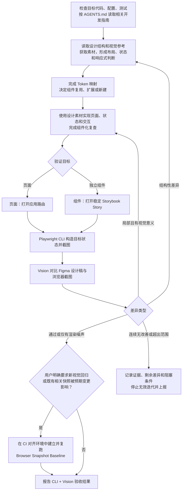

# Planet Figma 设计还原

## 目标与边界

将 Figma 设计高质量还原为当前代码库中的生产级前端实现。

重点保证：

- 高保真还原设计。
- 优先复用现有组件和 Design System。
- 正确使用 Design Token。
- 使用真实 Figma 素材。
- 保持代码可维护、可扩展。
- 通过真实浏览器验证并迭代视觉效果。

只负责 UI 实现和视觉还原，不负责：

- API Contract 设计或 API 接入。
- 业务逻辑、权限模型和缓存策略。
- 大规模架构重构。
- 与设计还原无关的功能开发。

## 输入要求

尽可能获取：

- 带 `node-id` 的 Figma Design URL。
- 目标页面、路由或组件。
- 需要实现的设计状态。
- 目标 Viewport。
- 当前代码库。

如果 Figma URL 缺少 `node-id`，要求用户提供节点级链接，不得猜测节点。

## 工作原则

按照以下主线工作；先遵守仓库约定完成定向检查，再读取设计，不得颠倒项目规定的阅读顺序：



避免：

```text
只看截图
→ 猜测 CSS
→ 堆积像素补丁
```

## 1. 先完成仓库定向

调用 Figma 工具前，先按 `AGENTS.md` 检查与目标直接相关的代码、配置和测试，再从 `docs/development/README.md` 选择任务所需的最少指南。不要预先遍历整个仓库或读取无关文档。

至少确认：

- 目标是应用页面、路由级 View，还是独立组件。
- 相关 route、view、component、Story、测试和公开出口当前如何组织。
- `src/shared/ui` 的相关组件及公开 API、`src/shared/styles/tokens.css` 的现有 Design Token。
- 现有布局、图标、素材、样式、响应式和测试约定。
- 可用于浏览器验证的稳定宿主：页面使用应用路由；独立组件优先使用现有 Storybook Story。

如果独立组件没有 Story，只有当组件具备可独立维护的稳定契约，且 Story 能长期记录有意义的 Variant、交互或边界内容时才新增或调整；否则报告缺少稳定验证宿主，不得为了截图向生产应用增加临时路由、临时 Story 或测试壳层。

形成简短的仓库侧结论，记录目标落点、可复用能力、验证宿主和必须遵守的项目约定。此阶段只做定向，不在读取 Figma 设计前决定最终视觉实现。

## 2. 理解设计稿并完成映射

写代码前，先加载 `figma-design-to-code`，再调用 `get_design_context`。

不要逐层机械翻译 Figma，也不要看到一个视觉块就立即创建组件。先理解设计意图和页面结构：

- **信息层级**：识别页面主任务、阅读顺序、主要内容、辅助信息和主要操作。
- **区域关系**：识别导航、内容、操作、反馈、弹层等区域，以及它们的包含、并列和覆盖关系。
- **重复模式**：识别列表项、卡片、表单项、操作组等重复结构，判断真正的组件边界。
- **布局规则**：先推理应使用 Document Flow、Flexbox、CSS Grid、固定定位还是其他布局策略；区分固定与流式尺寸、滚动区域、吸顶区域、弹性空间和响应式约束。将 Figma Frame 宽度视为视觉验证 Viewport，不得直接推导为生产页面宽度上限。
- **状态与交互**：理解默认、选中、禁用、加载、空、错误、展开和弹层等状态之间的关系，以及触发、切换、导航和反馈流程。
- **语义角色**：判断元素是按钮、链接、输入、标签、列表项、卡片还是纯装饰，不以外观代替语义。

再从结构数据、素材、视觉参考和 Design Token 四个方面读取设计：

- **结构数据**：检查页面层级、Auto Layout、Constraints、宽高、Padding、Gap、对齐、Typography、颜色、边框、圆角、阴影、Component、Variant 和 Variable。
- **素材**：识别并获取真实 SVG、图标、图片、Logo、插画和字体信息或文件；不要要求用户提前手动导出。
- **视觉**：获取 Figma Screenshot 作为最终参考，但不得只根据截图猜测页面结构和尺寸。
- **Design Token**：提取颜色、字体、字号、行高、间距、圆角、边框和阴影的设计值与语义，再结合仓库证据完成项目 Token 映射。

形成简短的设计侧结论，至少明确页面骨架、重复模式、组件及 Variant、状态与交互流程、响应式行为、布局策略、素材来源和待映射的 Token。结构无法解释时继续检查设计上下文，不要用 CSS 补丁掩盖理解缺失。

结合第 1 节的仓库证据，将设计值和语义映射到项目现有 Token、组件和布局模式。只有现有 Token 无法表达且需求确实时才考虑扩展。Token 映射和第 3 节的组件决策完成后再生成代码。

## 3. 决定组件方案

先判断语义、交互和归属，再判断视觉。稳定的通用语义、交互契约和实际复用证据共同决定是否进入 `shared/ui`；外观相似、Figma Component 身份或出现次数都不能单独决定归属。

只对复用、扩展、新建或归属存在实际选择的候选项记录简短决策；显然可直接复用的组件无需为表格而表格。

| 设计区域 | 语义与交互 | 代码库证据               | 决策与归属                      | 理由 |
| -------- | ---------- | ------------------------ | ------------------------------- | ---- |
| ...      | ...        | 已有 / 内联重复 / 不存在 | 复用 / 扩展 / 新建 / 保留；归属 | ...  |

按照以下边界决定归属：

- **已有组件**：语义、职责和交互契约一致时直接复用；只有受支持的视觉或组合差异时，通过 Token、Size、Variant、Slot 或 Composition 做向后兼容的扩展。
- **共享基础控件**：当前需求真实，职责不含业务概念，API 及焦点、禁用、加载、键盘和无障碍契约足够稳定时，可以在首次真实使用时进入 `shared/ui`；首次使用或第二次出现本身都不是抽取理由。
- **共享组合组件**：只有在语义和交互契约稳定，且有跨页面复用、可直接消除的重复实现或其他代码库证据时，才进入或扩展 `shared/ui`。Figma Component、Instance 和 Variant 只是辅助证据。
- **Feature 组件**：包含业务字段、领域术语、权限、流程或数据解释规则，或者通用 API 仍不稳定时，保留在所属 Feature。

对候选项依次检查：

1. 它解决什么用户问题，承担什么语义角色？
2. 它有哪些交互、状态和可访问性要求？
3. 现有组件的语义、职责和交互契约是否匹配？
4. 差异能否通过现有 API 或通用扩展自然表达，而不引入页面、业务专属 Props？
5. 共享归属的语义、契约和 API 是否已有足够证据且稳定？

修改公共组件前：

1. 阅读当前实现并搜索主要调用点。
2. 保留已有语义、状态、交互和可访问性契约。
3. 优先最小、向后兼容的通用扩展，不得加入单页面或业务特例。

不要因为 Figma 实例名称不同就重复创建组件，也不要因为现有组件“看起来接近”就强行复用。

如果需要 Breaking API Change、大范围修改 Design System、重构共享组件架构或大范围修改全局 Token，停止扩大任务并报告需要决策的问题。

## 4. 实现页面或组件

按以下顺序实现：

1. **结构**：完成目标层级、组件层级、布局模型和组件复用。
2. **几何**：调整宽高、Padding、Gap、对齐和定位。
3. **视觉**：调整 Typography、颜色、边框、圆角和阴影。
4. **素材**：处理图标、图片、Logo 和插画。
5. **细节**：修复 Overflow、文案换行、响应式问题和其他可见偏差。

普通布局优先使用 Document Flow、Flexbox、CSS Grid 和项目已有布局组件。

避免大量 Absolute Position、Magic Number、Inline Style 和截图专用补丁。允许使用设计中真实存在的特殊值，但不要为了消除渲染噪声破坏合理布局。

### 响应式宽度

- Figma Frame 的宽度是视觉验证 Viewport，不是生产页面的 `max-width`。例如 393px Frame 只表示应在 393px Viewport 检查几何和还原度。
- 页面根容器默认使用 `width: 100%` 或等价的流式布局。不得仅因为参考 Frame 为 393px 就写入 `width: 393px`、`max-width: 393px` 或对应的固定工具类。
- 只有产品明确要求居中限宽、代码库已有壳层约束，或设计结构与多个 Viewport 的证据明确存在最大内容宽度时，才允许设置 `max-width`。使用前说明依据，不得从单个 Frame 宽度猜测。
- 内部布局优先使用 `flex`、`grid`、`min-width: 0`、`gap`、`minmax()`、`clamp()` 等关系式约束。不要把某一 Frame 宽度下的子区域尺寸机械转写为固定 `width` 或 `max-width`。
- 需要在 Figma Frame 对应的 Viewport 保持特定几何时，使用可扩展的间距、弹性比例和尺寸边界表达关系；同时保证更宽或更窄的移动 Viewport 能合理伸缩、换行，且不产生横向 Overflow。

### 组件化复查

页面结构完成后、开始像素级视觉调整前，必须复查本次新增和修改的代码：

1. 搜索新增的原生表单和交互元素。
2. 检查是否复制了其他页面已有的导航栏、输入框、开关、选择器或列表模式。
3. 检查同一控件的核心状态样式和无障碍行为是否散落在业务调用处。
4. 检查共享组件 Props 是否含页面或业务专属概念。
5. 发现达到抽取门槛的能力时，先完成组件沉淀，再继续视觉调整。

## 5. 处理素材

如果设计中存在真实素材：

- 已有项目素材或图标的 glyph 经结构与视觉对比确认一致时直接复用；名称相同不能作为匹配证据。
- 没有已验证一致的项目素材时，从 Figma 获取真实导出。
- 不使用 Placeholder 或 Emoji 代替图标。
- 不自行绘制近似 SVG。
- 不随意替换成不同图片。
- 不根据名称相似就替换成图标库资源。

完成前，将素材保存到项目规定目录并使用稳定引用。最终代码不得依赖临时 Figma Asset URL。

### SVG React 与图片决策

先判断素材是否单色、是否需要随状态或主题变色，以及它是 UI 控件还是品牌/内容素材，再选择使用方式。不得把所有 Figma SVG 一律作为 ``，也不得把所有 SVG 一律转成 React Component。

- **单色 UI Glyph/Icon**：没有已验证一致的现有图标时，下载真实 Figma SVG；确认其不依赖当前 SVGR 流程会丢失的内部颜色或透明度关系后，使用显式 `?react` 导入为 React Component，通过 `className` 控制尺寸，并通过 `currentColor` 继承语义颜色。
- **多色 SVG、Logo、品牌图形和插画**：保留原始颜色，以 URL 导入并使用 ``。
- **照片和其他位图**：以 URL 导入并使用 ``。

所有装饰性 SVG 和图片分别使用 `aria-hidden` 或空 `alt`；独立表达含义的图标提供可访问名称，有内容语义的 `` 提供有效 `alt`。图标不得成为状态的唯一提示。

不要为了复用单色图标流程而破坏品牌色、内容色或插画内部色彩关系。

### `currentColor` 与 SVGO 安全配置

只对显式 `?react` 的单色图标应用强制 `currentColor` 转换。不得使用 `removeAttrs` 删除 `fill`、`stroke` 或 `stroke-width`；删除 `stroke` 或 `stroke-width` 会破坏搜索、箭头等描边图标的几何。

推荐在 SVGO 配置中使用：

```js
{
  name: "convertColors",
  params: { currentColor: true },
}
```

该配置会把非 `none` 的 `fill` 和 `stroke` 颜色转为 `currentColor`，同时保留原本的填充/描边模型与 `stroke-width`。保留 `viewBox`，让尺寸由 CSS 控制。

使用 `?react` 前检查 SVG 源文件和项目实际 SVGR/SVGO 配置。当前项目配置会对所有 `?react` SVG 删除 `fill-opacity` 和 `stroke-opacity`；只有透明度可以由单一调用方语义样式完整恢复时，素材才适合直接进入该流程。

如果图标依赖多个 path 的局部透明度，单个调用方 Class 不能恢复其层级：固定颜色素材应保留原始 SVG 并按 URL 使用；必须同时支持 `currentColor` 和局部透明度时，报告需要调整共享 SVGR 配置的决策，不得在页面实现中静默修改全局配置或用 CSS 补丁近似。

如果 Vite 与 Vitest 使用独立配置，必须抽取并复用同一份 SVGR/SVGO 配置。否则测试环境可能把 `?react` SVG 当成 URL 或 Data URI，而不是 React Component。

## 6. 浏览器视觉迭代闭环

初版实现达到可验证状态后，加载 `playwright` skill，并使用 Playwright CLI 在真实浏览器中构造目标状态、交互和截图。CLI + Vision 验收是本 skill 的默认验证方式；迭代阶段不要改用手工截图，也不要为了截图编写临时 Playwright 测试文件。

工具职责不可混用：

- **Playwright CLI**：负责真实浏览器渲染、交互、状态构造和截图。
- **Vision**：负责对比 Figma 设计稿与浏览器截图，识别差异并判断差异是否具有视觉意义。

### 选择稳定验证宿主

- **页面或路由级 View**：启动应用，使用可直接进入目标状态的应用 URL。
- **独立组件**：启动 Storybook，使用对应 Story 的稳定 URL；通过 Args、Story 状态或真实交互构造 Variant。不得为了验证组件向生产应用增加临时路由。
- **组合目标**：按实际交付边界选择宿主；需要页面上下文才能成立时按页面验证，否则按组件验证。

宿主无法稳定呈现设计状态时，只补齐属于本次真实交付且具有长期价值的 Story、确定性 props 或已有测试数据装配。若不存在合理的长期宿主，或这要求 API 接入、业务逻辑或其他超出本 skill 范围的改动，停止扩大任务并报告阻塞条件。

先确认 `npx` 可用，再使用 Playwright skill 提供的包装脚本：

```bash
command -v npx >/dev/null 2>&1
export PLANET_PWCLI="${CODEX_HOME:-$HOME/.codex}/skills/playwright/scripts/playwright_cli.sh"
```

创建 `output/playwright/<任务名称>/`，并将其作为以下 Playwright CLI 命令的工作目录，使裸 `snapshot`、`screenshot` 和其他临时产物都留在该目录；不要新增其他顶层产物目录。

按照以下顺序操作：

1. 从仓库根目录启动应用或 Storybook，并确认目标绝对 URL。
2. 从任务产物目录使用 `"$PLANET_PWCLI" open <URL> --headed` 打开目标。
3. 使用 `"$PLANET_PWCLI" resize <width> <height>` 设置为 Figma Frame 对应的 Viewport。
4. 使用 `"$PLANET_PWCLI" snapshot` 获取当前结构和稳定元素引用。
5. 使用最新 Snapshot 中的引用执行 Click、Fill、Hover 或 Press，进入设计对应状态。
6. 发生导航、弹层开关或明显 DOM 变化后重新 Snapshot。
7. 页面稳定后使用 `"$PLANET_PWCLI" screenshot` 截图。

先在 Figma Frame 对应的 Viewport 检查视觉还原，再额外验证代表性的更窄和更宽移动 Viewport，重点检查流式伸缩、文案换行和横向 Overflow。例如参考 Frame 为 393px 时，430px 可以作为更宽 Viewport，但它不是固定要求；应根据目标设备范围选择验证宽度。

元素引用失效时重新 Snapshot，不得绕过引用直接猜测选择器。只有 Playwright CLI 的显式命令无法完成等待或状态准备时，才使用 `run-code`。

截图前确保：

- 字体和图片加载完成。
- 页面数据已经稳定。
- Animation 和 Transition 不影响截图。
- Modal、Dropdown、Selected、Expanded 等状态正确。
- Playwright Console 中没有新增错误。

完成一次目标状态截图后，使用 Vision 与 Figma Screenshot 对比，重点检查：

1. 整体布局和页面层级。
2. 元素尺寸、对齐和间距。
3. Typography 和颜色。
4. Border、Radius 和 Shadow。
5. 图标、图片和其他素材。
6. Overflow、换行和响应式问题。

根据主要差异修改实现，然后重新构造同一状态并截图。每轮优先处理：

```text
Layout
→ Size
→ Spacing
→ Alignment
→ Typography
→ Color
→ Border 和 Shadow
→ Minor Polish
```

如果 Vision 发现某个区域不正确，使用 Figma 结构化尺寸、DOM Bounding Box、Computed Style 或浏览器测量结果确认原因；不要依赖 Vision 猜测精确像素，也不需要建立完整的 Figma Node 与 DOM Node 映射。

### 停止无效迭代

- 同一主要差异经过连续两次有证据的局部修改仍未缩小时，停止微调并回到设计、组件和布局分析，只做一次根因修正。
- 根因修正后差异仍未缩小，或确认依赖缺失字体、不可获取素材、不稳定数据、浏览器环境差异、外部权限或超出任务范围的改动时，结束当前视觉循环。
- 结束循环时记录对比截图、测量证据、已尝试修正、剩余差异和继续所需条件；不得宣称视觉验收通过，也不得创建或更新 Baseline 来掩盖失败。
- 如果继续需要新的用户选择、权限或范围，报告具体阻塞并请求决策；获得新证据或条件后再恢复验证。

## 7. 最终视觉验收与可选 Snapshot Baseline

完成主要迭代且不存在已知结构性差异后，必须再次由 Playwright CLI 构造目标状态并截图，再由 Vision 与设计稿做独立的最终对比：

- 存在可在当前范围内修复的视觉差异：回到第 6 节，修改后重新进入最终验收。
- 仅存在抗锯齿、阴影、SVG 栅格化、子像素等无视觉意义的渲染噪声：可以判定通过。
- 仍存在结构性差异或已触发停止条件：不得判定通过；按第 6 节记录证据并报告。

Figma 设计图只用于 Figma ↔ Browser 验收，不是长期 Playwright Baseline，也不使用严格 Pixel Equality 作为通过标准。

### 仅在明确需要时建立视觉回归用例

默认停留在 Playwright CLI + Vision 验收，不创建 `@playwright/test` spec 或 Snapshot Baseline。只有以下情况才进入视觉回归测试：

- 用户明确要求新增或更新视觉回归测试文件时，可以按仓库测试分层新建或维护用例。
- 仓库已经存在与本次目标直接相关的 Screenshot 用例，且最终 Vision 已确认的预期视觉变化使其失效时，必须维护现有用例和 Baseline；这不授权为其他目标新建视觉测试。

即使具备授权，也必须先确认：

- 最终 Vision 验收已经通过。
- Browser、Viewport、字体、Locale、Timezone、Animation、数据和页面或 Story 状态可以确定性重建。
- Baseline 能在与 CI 相同的操作系统、锁定浏览器版本和字体环境中生成；不得默认使用本机 macOS 快照满足 Ubuntu CI。
- 目标符合仓库的测试分层；独立组件没有既有视觉回归基础设施时，报告需要项目级决策，不得把它硬塞进应用 E2E 或增加临时生产路由。

满足条件时，优先使用仓库已有的容器或 CI Snapshot 更新流程，通过 `expect(page).toHaveScreenshot(...)` 为仓库要求的 Playwright Project 和平台生成 Baseline，先更新 Snapshot，再在同一环境正常运行同一用例以及项目要求的 E2E 命令。仓库没有 CI 等价生成入口、环境未固定或 CI 平台 Baseline 无法生成时，不自行发明基础设施，也不创建不可维护的本地快照；报告缺失前提并请求项目级决策。

不得把 Figma Screenshot 复制或转换为 Baseline，不得手工把迭代期 CLI Screenshot 塞入 Snapshot 目录，也不得在设计验收前更新 Baseline 来消除失败。

## 8. 完成检查

完成前确认：

### 设计还原

- 目标层级和主要布局正确。
- 尺寸、间距和对齐没有明显问题。
- Typography、颜色、边框、圆角和阴影合理。
- 使用了正确素材且没有遗漏主要 UI。
- 已使用应用路由或稳定 Storybook Story 作为与交付边界匹配的验证宿主，没有为截图添加临时生产入口。
- Figma Frame 对应的 Viewport、代表性的更窄和更宽移动 Viewport，以及关键目标状态已在浏览器中验证；至少包含一个非 Figma Frame 宽度的 Viewport。
- 未触发停止条件时，Playwright 截图与 Figma 设计稿的 Vision 对比已收敛，并通过独立的最终验收；已忽略的差异仅为无视觉意义的渲染噪声。
- 触发停止条件时，未宣称视觉验收通过、未用 Baseline 掩盖失败，并已记录证据、剩余差异和继续所需条件。
- 只有用户明确要求新视觉回归，或既有相关 Screenshot 用例被预期视觉变更影响，并且满足稳定性、测试分层与 CI 环境条件时，才创建或维护 Playwright 视觉回归；否则已记录“不适用”或未执行原因。
- 没有明显 Overflow 或 Layout Shift。

### 工程质量

- 优先复用了已有组件和 Design Token。
- 已检查本次新增的 `button`、`input`、`select`、`textarea` 和自定义 ARIA 控件。
- 原生控件基础能力已复用或沉淀到 `shared/ui`，未重复实现核心状态和无障碍行为。
- 与现有页面重复的通用组合模式已复用、扩展或下沉。
- 保留在 Feature 中的组件具有明确业务语义，或尚未达到通用组合组件的抽取门槛。
- 没有复制已有公共组件或污染公共组件 API。
- 没有大量 Absolute Position 或截图补丁。
- 页面不存在从 Figma Frame 宽度机械生成的固定 `width` 或 `max-width`；允许的限宽均有产品、现有壳层或设计证据。
- 内部布局使用可扩展的关系式约束，在非 Figma 宽度下能合理伸缩和换行。
- 单色图标使用 React SVG 与 `currentColor`；多色、品牌和内容素材继续使用 `` 并保留原色。
- SVGO 没有删除 `stroke` 或 `stroke-width`，描边图标的线宽与几何未被破坏。
- 含局部透明度的 SVG 已检查实际导入链路，没有依赖调用处单一 `opacity` 补偿多个透明度层级。
- Vite 与 Vitest 存在独立配置时复用了同一份 SVGR/SVGO 配置。
- TypeScript 类型正确且没有新增 Console Error。

### 工程验证

- 运行受影响范围的最小单元、组件或浏览器测试。
- 交付前运行 `pnpm verify`。
- 新增或修改 Story、使用 Storybook 作为组件验证宿主，或改变共享组件公共 API 时，额外运行 `pnpm storybook:build`。
- 修改 Route、部署路径、PWA、Playwright 用例或 Snapshot Baseline 时，额外运行 `pnpm test:e2e`。
- `pnpm verify` 不包含 Storybook 构建和 E2E；无法执行的命令必须说明原因，不得宣称已通过。

## 9. 完成报告

返回简洁报告：

```text
设计还原结果

修改文件：
- ...

复用组件：
- ...

组件审计：
- 发现的已有实现：
- 发现的跨页面重复模式：
- 保留为 Feature 组件的原因：

扩展组件：
- ...

新增组件：
- ...

未抽取的组件候选：
- ...

新增素材：
- ...

浏览器验证：
- 验证宿主（应用路由 / Storybook Story）：
- Figma Frame 对应的 Viewport：
- 额外移动 Viewport：
- 目标状态：
- Vision 迭代轮次与主要修正：
- 最终对比结论：
- Playwright Snapshot Baseline（已维护 / 不适用 / 未执行及原因）：

剩余视觉差异：
- ...

停止条件与证据：
- 未触发 / 触发原因：
- 最后截图与测量证据：
- 已尝试方案：

工程验证：
- 受影响测试：
- pnpm verify：
- pnpm storybook:build（通过 / 不适用 / 未执行及原因）：
- pnpm test:e2e（通过 / 不适用 / 未执行及原因）：

需要上层决策的问题：
- ...
```

没有需要升级的问题时，明确写“需要上层决策的问题：无”。不得只回复“完成”。

## 最终原则

目标不是让浏览器截图和 Figma PNG 的每个像素完全相同，而是同时满足：

```text
设计意图
+ 现有工程体系
+ 正确组件抽象
+ 高视觉还原度
+ 可维护代码
```
